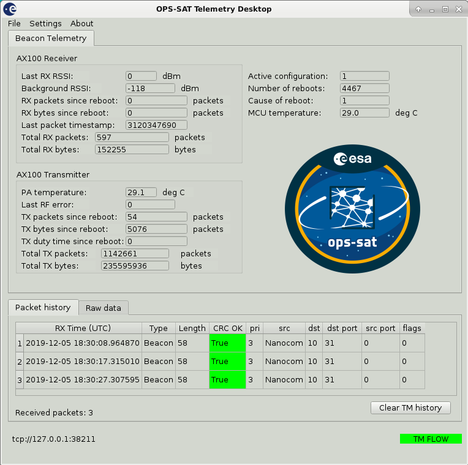
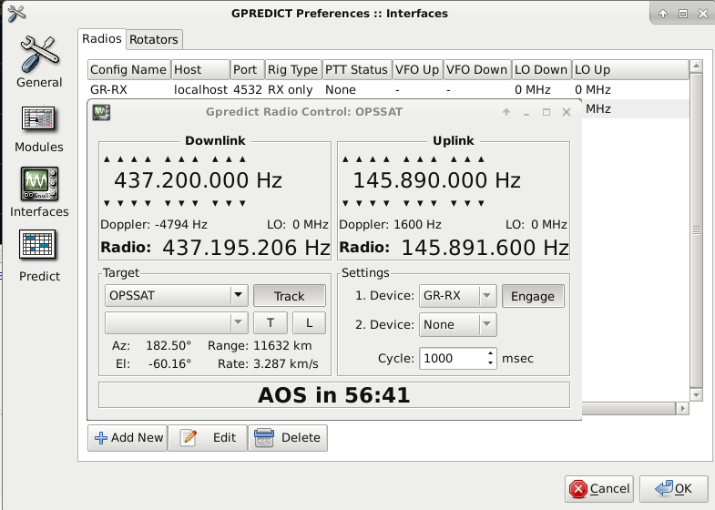

# gr-opssat

Authors: Fischer Benjamin (benjamin.fischer@esa.int), Tom Mladenov (tom.mladenov@esa.int)

This repository contains documentation, and applications for receiving, demodulating, and decoding the UHF signal transmitted by the ESA OPS-SAT mission. It also contains a full graphical application for viewing and parsing the beacon frames transmitted by OPS-SAT.

https://opssat1.esoc.esa.int/

https://www.esa.int/Our_Activities/Operations/OPS-SAT

## Overview

### UHF specifications
Can be found in docs/os-uhf-specs.pdf

### Applications
1. UHF receiver application (apps/os_uhf_rx.grc)
    1. Offset sampling
    2. Doppler compensation (with GPredict)
    3. Frequency shifting to baseband and downsampling
    5. Noise suppressor (Squelch)
    4. ZMQ sink
2. OPS-SAT demodulator and decoder (apps/os-demod-decode.grc)
    1. ZMQ source
    2. GMSK demodulator
    3. Decoder
    5. Output: Payload frame
3. OPS-SAT UHF Desktop (apps/desktop/main.py)
    1. Written in Python 3
    2. Uses a ZMQ subscriber to get data from GR flowgraph (apps/os-demod-decode.py)
    3. Parses, and views beacon content fields in engineering values
    
### Dependencies
1. UHF receiver application (os_uhf_rx.grc)
    1. https://github.com/wnagele/gr-gpredict-doppler
2. OPS-SAT demodulator and decoder (os-demod-decode.grc)
    1. https://github.com/daniestevez/gr-satellites
3. OPS-SAT UHF Desktop (apps/desktop/main.py)
    1. Python 3
    1. https://pypi.org/project/PyQt5/
    2. https://pypi.org/project/pyzmq/
    3. https://pypi.org/project/crccheck/
    
### Recordings
A clean recording of the NanoCom AX100 beacon can be found in recordings/


## Getting started

Install all dependencies for the grc flowgraphs and the GUI Desktop application.
For initial testing purposes, you can unzip the beacon recording in the folder 'recordings' and make the file source block in os_uhf_rx.grc point to the
unzipped .cf32 file. The samplerate of the beacon recording is 200 ksps so make sure in os_uhf_rx.grc this is the set samp_rate. Regenerate the python code from gnuradio-companion.

Run the receiver flowgraph:
```
python apps/os_uhf_rx.py
```

Then start the demodulator/decoder:
```
python apps/os-demod-decode.py
```
You should now see PDU's being printed in the terminal of the demodulator application every 10 seconds.

To parse and view the beacon contents, the OPS-SAT desktop application can be started with:
```
python3 apps/desktop/main.py
```

It receives the RS decoded CSP packet + 4 byte CRC32-C over a ZMQ socket on localhost port 38211 to which it is subscribed.
You should now see beacon frames being parsed and displayed:



The raw packet history shows the received packets, CRC check status and CSP header information.

This application writes to 2 logfiles in apps/desktop/log:
* One log contains the beacon hex data (beacon.log)
* The other log contains timestamped events (gui_event.log)

The GUI desktop application does not need to be running for the system to operate, i.e. the receiver application and demodulator application can operatate standalone. The GUI desktop is merely meant for parsing and viewing AX100 beacon contents.


## Operational usage with live reception
For operational usage, the device source blocks should be used instead of a file source block.

For usage with an RTL-SDR for example the following adaptions must be performed:

os_uhf_rx.grc:
* disable the file source block
* enable the RTL-SDR source block
* bypass the throttle block
* set samp_rate to 250k (resulted in best performance)


os_demod_decode.grc:
* bypass the throttle block

Next configure the doppler correction in Gpredict:
* Gpredict preferences -> interfaces -> add a 'Radio' interface with RX only settings and localhost port 4532.

When using the drop-down arrow in the main gpredict tracking interface and selecting 'Radio Control' you should see the following interface:



Upon starting the GNURadio flowgraphs:
* Set Downlink frequency to 437200000
* Under 'Target' select OPSSAT and click 'Track'
* Under 'Settings' select Device no 1 as the configured RX interface and click 'Engage'


Once it is known which of the pre-assigned NORAD IDs of Arianespace launch VS23 belongs to OPS-SAT, the currently disabled
telemetry forwarder block in os-demod-decode.grc can be used to forward telemetry to various servers such as SatnogsDB.


