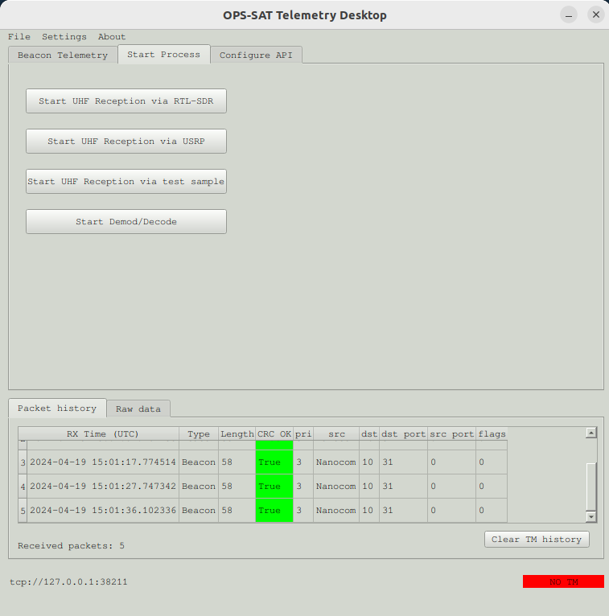
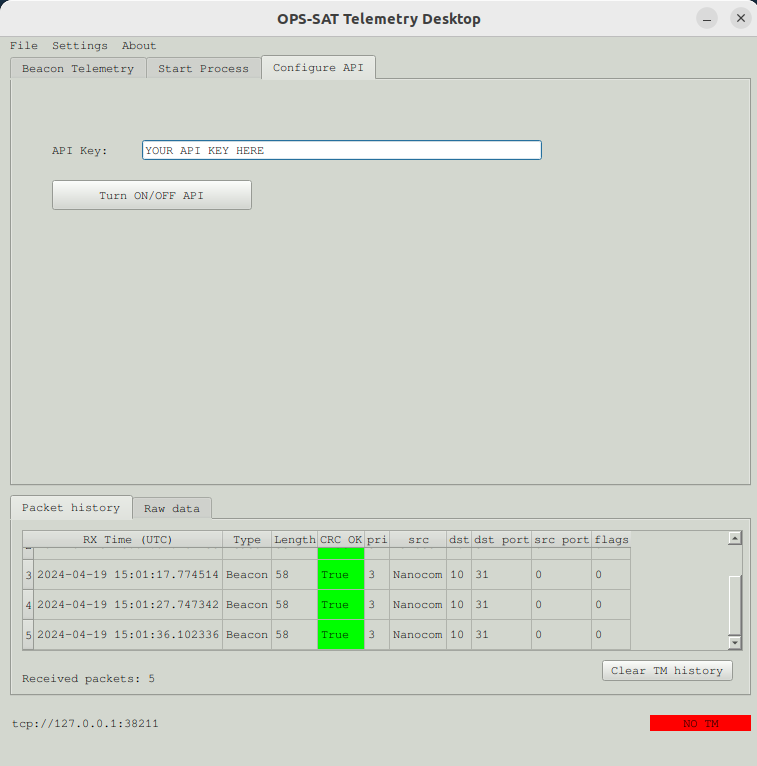

# Welcome to the radio community guide for the UHF campain of OPS-SAT-1
## Getting started with the Desktop application

To begin, you'll need to launch the desktop application, enabling you to receive and decode the UFC packets from OPS-SAT-1 using either an RTL-SDR or a USRP. This application is distributed as a Linux AppImage, presently accessible for x86_64 and aarch64 architectures. [You can download it from the release section of this repository](https://github.com/esa/gr-opssat/releases).  
Once you have the appropriate version, you will need to make it executable using the bash command `chmod +x ./opssat_uhf-$ARCH.AppImage`.  
You can now start it with `./opssat_uhf-$ARCH.AppImage`.  
The AppImage is packed with a conda environement with all the needed dependancies in it, which should allows it to run out-of-the-box. Once started you will find this interface with the last received telemetry and the packet history:  
  
Switch from the table `Beacon Telemetry` to the table `Start Process` for the first test. You will find here four buttons associated to four different gnuradio scripts. The first three are used for reception. Firstly we will use the third one which replay a test sample. With start the process `Start Demod/Decode`. You should have the two corresponding buttons turning green, once the processes have started.  
  
You can kill these two processes whenever you want by simply closing the associated windows.  

Now, you should be ready to receive real packets! Connect the SDR of you station to your computer. You can now follow the [Operational usage with live reception](#configuring-gpredict) to configure Gpredict.

## Sending packets to the Mission Control Team

Are-you ready to get involve into the reentry UHF campain for OPS-SAT-1? For this, you will need your API key. [Please go to our home page](https://opssat1.esoc.esa.int/frames-collector) where you can also find a leaderboard with all the radio amateurs, based on the number of packets sent to us. Here, you will be able to register. Please keep in mind that your coordonates are optionals, and your username will be displayed in the leaderboard.  
  
After being registered, an API key will be displayed to you and sent by email.  
Now, everytime before starting a reception process, please go to the `Configure API` tab of the desktop application, input your API key in the appropriate input field, and turn ON API (note that for obvious reason, turning on API will block you from replaying the test sample).  
This will allow every UHF packets you will receive will to be sent via API to our database :smile: and to try to be at the top of the leaderboard!
  

## Configuring GPredict

**First, make sure the ppm offset of your SDR are set correctly and that your system UTC time is correct.**

Next configure the doppler correction in Gpredict:
* Gpredict preferences -> interfaces -> add a 'Radio' interface with RX only settings and localhost port 4532.

When using the drop-down arrow in the main gpredict tracking interface and selecting 'Radio Control' you should see the following interface:

Upon starting the GNURadio flowgraphs:
* Set Downlink frequency to 437200000
* Under 'Target' select OPSSAT and click 'Track'
* Under 'Settings' select Device no 1 as the configured RX interface and click 'Engage'

