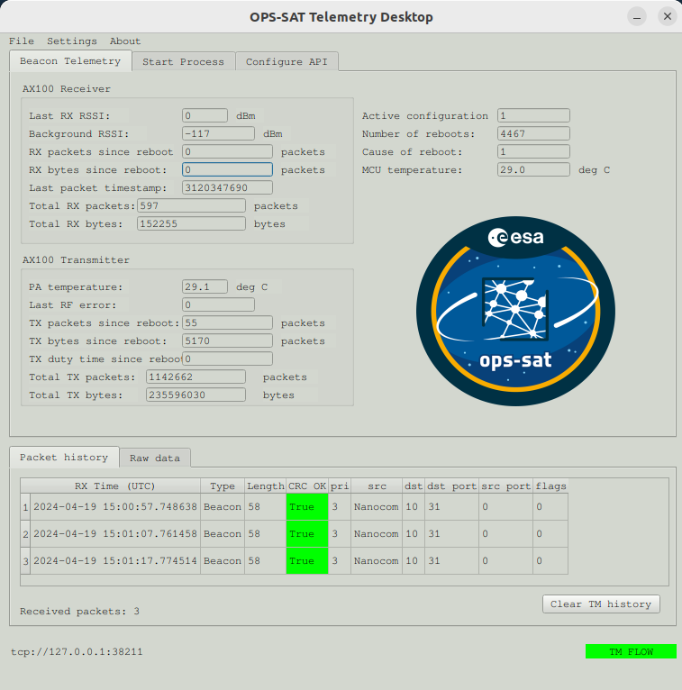
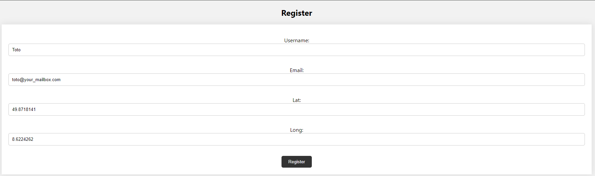

[work in progress]
# Welcome to the radio community guide for the UHF campain of OPS-SAT-1
## Getting started with the Desktop application

To begin, you will need to install the dependencies for the application.  
Be aware that the application also only support python 3.
The minimum dependencies that have been validated are obtained via a conda environment via the command `conda install [package name]`. Some of them can be directly included in [radioconda](https://github.com/ryanvolz/radioconda) which we recommand to use.
```
gnuradio-gpredict-doppler=0.0.0.20231030.dev+g7114d423e unix_pyh9f2d41d_0
gnuradio=3.10.9.2
gnuradio-satellites=5.5.0
pyqt=5.15.9
qt=5.15.8
pyzmq=25.1.2
crccheck=1.3.0
gnuradio-osmosdr=0.2.4
```
The following packages are mandatory and can be installed via pip:
```
numpy==1.26.3
requests==2.31.0
```

To begin, you'll need to launch the desktop application, enabling you to receive and decode the UFC packets from OPS-SAT-1 using either an RTL-SDR or a USRP.  
You can now start the application with `python3 main.py`.  
Once started you will find this interface with the last received telemetry and the packet history:  
  
You have then to start the gnu radio processes `uhf reception` and `demod decode`. You can find the `gnu radio companion` files in `gr-opssat/app-grc_script/lib/`.
You have to edit the `os_uhf_rx_gnu310.grc` to choose the source SDR. You also have a sample recording to test the app. **Be aware to not send us the frames of this recording via the API**

Now, you should be ready to receive real packets! Connect the SDR of you station to your computer. You can now follow the [Operational usage with live reception](#configuring-gpredict) to configure Gpredict.

## Sending packets to the Mission Control Team

Are-you ready to get involve into the reentry UHF campain for OPS-SAT-1? For this, you will need your API key. [Please go to our home page](https://opssat1.esoc.esa.int/frames-collector) where you can also find a leaderboard with all the radio amateurs, based on the number of packets sent to us. Here, you will be able to register. Please keep in mind that your coordonates are optionals, and your username will be displayed in the leaderboard.  
  
After being registered, an API key will be displayed to you and sent by email.  
This will allow every UHF packets you will receive will to be sent via API to our database :smile: and to try to be at the top of the leaderboard!
  

## Configuring GPredict

**First, make sure the ppm offset of your SDR are set correctly and that your system UTC time is correct.**

Next configure the doppler correction in Gpredict:
* Gpredict preferences -> interfaces -> add a 'Radio' interface with RX only settings and localhost port 4532.

When using the drop-down arrow in the main gpredict tracking interface and selecting 'Radio Control' you should see the following interface:


Upon starting the GNURadio flowgraphs:
* Set Downlink frequency to 437200000
* Under 'Target' select OPSSAT and click 'Track'
* Under 'Settings' select Device no 1 as the configured RX interface and click 'Engage'


